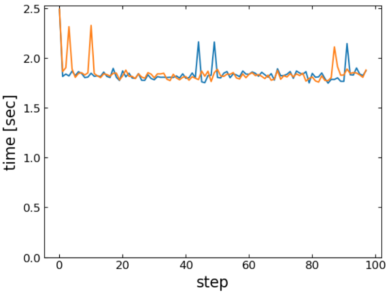

# CMBLensing.jl GPU benchmarks for NERSC

## Install

```shell
git clone https://github.com/marius311/CMBLensing_NERSC_benchmarks.git
cd CMBLensing_NERSC_benchmarks
pip install camb
julia -e "using Pkg; Pkg.instantiate()"
```

Additionally, the following environment variables should be set:
```shell
export JULIA_MPI_TRANSPORT=TCP # for MPIClusterManagers.jl
export JULIA_CUDA_USE_BINARYBUILDER=false # to use NERSC's CUDA module
```

On CORI, I've tested with `cuda/11.3.0`.

## Configure

The main options to change in the short script (if desired) are:

* `Nside` - The maps which are analyzed have `Nside^2` number of pixels in them. 256 is more or less what we've been running. 512 and 1024 are reasonable. Beyond that is uncharted territory (for me) and may OOM, etc..

* `T` - Can be changed to `Float64`.

* `nsamps_per_chain` - Number of Monte Carlo samples to draw (basically the length of the run).

## Run

```
srun -n N run_chain.jl
```

This runs `N-1` parallel GPU chains (one process is master and doesn't run a chain). This _should_ work on GPUs spread across any number of nodes, but its been a while since I've tested multi-node runs. The output is saved to `test_chain.jld2`. Precompilation time is significant, expect a few minutes until the first sample and until logging is printed. 

## Analyzing

The logging prints a detailed breakdown of the timing of different parts of the code, which can be used as a benchmark. Additionally, the chain file saves the timing of each of several sub-steps of each chain step. The most interesting being the 1st and 3rd (here plotting the 3rd):

```julia
using CMBLensing, PyPlot
chains = load_chains("test_chain.jld2", unbatch=false);
plot.(chains[:,3:end,:timing,3])
ylim(0)
xlabel("step")
ylabel("time [sec]")
```

Here's an example run with `Nside=256`, `T=Float32`, and two parallel chains on CORI: 



